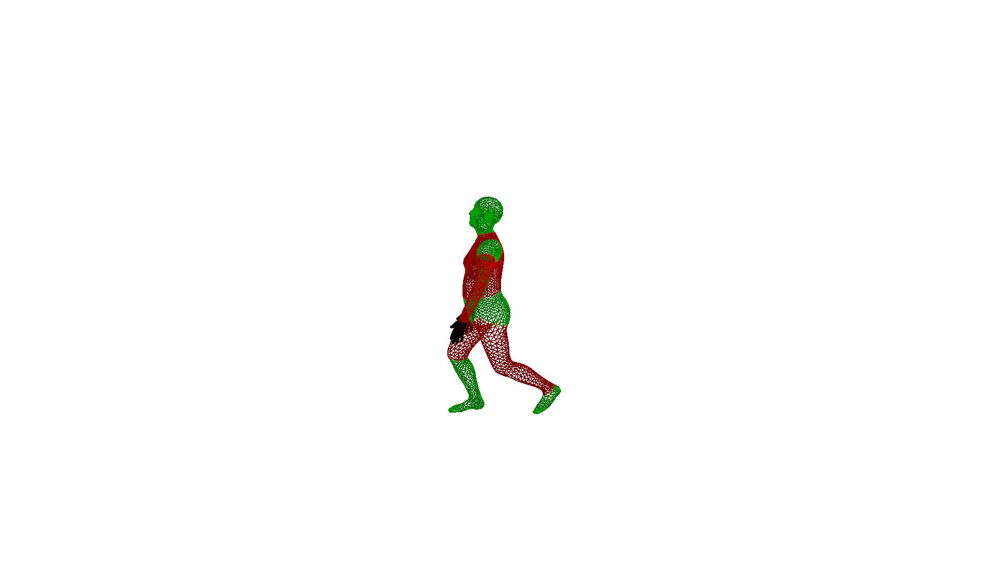

# Dance-Fitness

This repository contains two major components. 

1. Code to run 5 3D Human Pose Estimators on a single, or multiple RGB video(s). It then renders the results - i.e. the 3D meshes and 3D skeletons - as follows.

2. Code to compare two 3D human meshes - i.e. comparing the discrepancies in the angles of the limbs - and visualising the discrepancies as follows. Here, the grey mesh is the reference (or correct) mesh. The colored mesh is the input mesh, i.e. the mesh that we want to compare with the reference. The limbs of this mesh are colored based on the correctness. Green means that limb position is within the accepted error range w.r.t. reference, and red means it is outside of the accepted error range. Note, this is done in 3D.

### Hardware

This code has been tested on an Ubuntu 18.04 machine.

## Testing 5 Human Pose Estimators

1. Clone these repositories and follow their installation instructions.

- ROMP https://github.com/Saafke/ROMP 
- DecoMR https://github.com/Saafke/DecoMR
- ExPose https://github.com/Saafke/expose
- VIBE https://github.com/Saafke/VIBE
- VideoPose3D https://github.com/facebookresearch/VideoPose3D 

2. Now we can run the above methods on your input video(s). Use bash to run the "run50clips.sh" script. Make sure to change the directories in this script, to your correct directories. That is, the directories where you installed the above methods. Execute the following command:

First, go into the correct subfolder of this repository:

`$ cd test_five_methods`

Then run:

`$ bash run50clips.sh` 

This will run the methods on your input video(s) and store the results - i.e. the estimated 3D meshes (or skeletons) and camera parameters - in the output folders.

3. If we want to visualise the results, we need to render them. This code will visualise the 3D meshes (or skeletons) from a front-view and a side-view (90 degrees rotated about the up-axis) on a white background. It renders the estimations via a weak-perspective camera model. [Note: the results for VideoPose3D have already been rendered, so need for that here.] Execute the following command:

`$ python my-renderer.py`

4. The above code renders independent videos for each method. To combine the videos - i.e. visualise them into 3 columns and 2 rows, as shown above - we can use the make_qual.py file. Again, make sure to change the directories.

`$ python make_qual.py`

## Comparing Two Human Meshes

This will compare two estimated SMPL meshes. We first extract the 3D skeleton from the meshes. We then compare the 3D angles of each limb between MESH1 and MESH2. We visualise the discrepancies - i.e. the differences between the limbs' 3D angles - via coloring the body parts RED (discrepancy goes over threshold) or GREEN (discrepancy is within threshold). The error threshold is a hyperparameter you can change. To try the toy-example, simple run:

`python compare_two_humans/compare_and_vis.py`

Your result is the output.png file. To try your own meshes, change the file paths in compare_and_vis.py with your own estimations or ground-truths. These should be in the form of SMPL models, such the estimations from VIBE, ExPose or ROMP.
